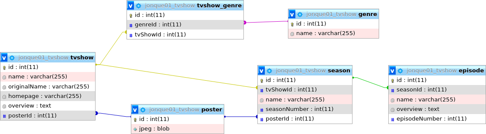

# SAE2-01
#### Par Raphael Gomes et Benoit Collot
  
## Important
### Clonage du Git avec la commande : ```git clone https://iut-info.univ-reims.fr/gitlab/coll0261/php-crud-tv-show.git```

### Windows

Sur Windows, il faut retirer le point dans les fichiers qui commence par un point comme **.php-cs-fixer.php** pour laisser
**php-cs-fixer.php**

## Serveur local

On utilisera la commande ```Composer "start:linux"``` pour lancer le serveur local 
sur Linux et ```Composer:windows``` pour lancer sur Windows
puis rendez-vous a l'adresse : http://localhost:8000/ Pour accéder à la première page

## Style de codage

Php fixer permet de tester votre code afin de voir s'il correspond à la norme indiquée ici Psr-4.
Pour utiliser php cs fixer différente commande :  
```php vendor/bin/php-cs-fixer fix --dry-run``` --dry-run pour test a blanc   
```--diff``` pour voir la différence entre l'original et celui modifier  
Retire --dry-run pour avoir les fichiers qui sont fixés automatiquement.  
On préférera utiliser les commandes faites avec composer pour gagner du temps :  
```composer "test:cs"``` pour voir quel fichier comporte des problèmes  
```composer "fix:cs"``` pour fixer les problèmes  

## Tests

Les Tests se font avec codeception et sont dans des commandes composer :  
```composer test:<nom_suitedeTest>``` Pour faire une suite de tests en particulier ici Browse ou Crud 
```composer test:codeception``` pour l'ensemble des tests   
```composer test```Pour l'ensemble des tests & les tests de php-fixer pour la correspondance a la norme PSR-12.  

## Installation dépendance  
  
* Le projet nécéssite composer, minimum php8.3 
* Lors d'un clonage du Git utiliser la commande ```composer install``` pour l'installation des paquets nécessaire au fonctionnement du projet dans /vendor/.  
Cela mettre également à jour l'auto chargement sinon utilisé ```composer dump-autoload```.  
* Pour configurer le lien avec la base de donnée, créer à la racine un fichier .mypdo.ini contenant :     
    ```
  [mypdo]  
  dsn = 'mysql:host=mysql;dbname=Nom-de-la-BD;charset=utf8'  
  username = 'Identifiant'  
  password = 'Mot-de-passe'```  
* Pour l'Intégration de php-Fixer dans phpStorm se fait dans ___Settings (CTRL+ALT+S)\Php\Quality_Tools\Php cs fixer - Rulesets : custom + chemin vers.php-cs-Fixer.php + mettre sur ON___
Et ne pas oublier de mettre dans ___Settings\Php\Quality_Tools de mettre php-cs-fixer dans External formatter___.
* 
### Installation composer -> linux
```sudo apt-install composer``` installation globale sur une distribution ubuntu sinon [https://getcomposer.org/download/](ici), pour le guide taper la commande composer 

### Installation composer -> Window
Le fichier de setup est dans bin 

## Classe et Fonctionnement

Le Projet Comporte 5 classe **Tvshow, Season, Poster, Genre, Episode** correspondent aux 5 tables de la base de Donnée ces 5 classes comporte des getters sur l'ensemble de leur attribut.  
Les classes Tvshow, Season, Poster, Genre, Episode ont une méthode nommée ```findById``` qui sert de constructeur et qui va chercher dans la base de données l'ensemble des champs en utilisant l'id qui est passée en paramètre.  
De plus, il y a les classes EpisodeCollection, SeasonCollection et TvshowCollection ses classes sont utilisée pour récupérer de nombreuses données de même type que le nom de la collection sous Forme d'array. Ils comportent deux méthodes :  
```findAll()``` qui renvoie l'ensemble des données de la table  
````findBy_Autre_Class_Id````qui renvoie l'ensemble des données des saisons/épisodes pour le tvshow/la saison avec l'id passé en paramètre
Les classe pour les creation des formulaires sont SeasonForm et TvShowForm, elles ont pour attribue les classes utilisées pour la creation et completions des formulaires, elles possèdent chacune deux méthodes, une avec le code Html du formulaire 
et l'autre avec de quoi récupérer les données envoyées en POST

## Fonctionalité

#### Page d'accueil :
La page d'accueil montre la liste des séries présentes dans la base de donnée (poster, titre, description). Chaque bloc contenant une série est cliquable et permet d'aller sur la page de la série.   
Le menu présente plusieurs boutons :
* ajouter : envoye vers un formulaire permettant de créer une nouvelle série en entrant : le nom, le nom d'origine, le lien de la page d'accueil et la description.
* Menu déroulant : permet de choisir le genre des séries que l'on veut afficher
#### Page d'une série :
La page d'une série montre tout en haut, les informations de la série : Poster, titre, titre d'origine et déscription. La page montre également la liste des saisons qui redirige chacune vers leur page personnelle.
Le menu présente plusieurs boutons :
* index : permet de retourner à la page d'accueil.
* Modifier : envoye vers un formulaire permettant de modifier le titre, le titre d'origine, le lien de la page d'accueil et la description.
* Supprimer : supprime la série.
* Ajouter une Saison : Formulaire pour entrer le numéro de saison et le nom
#### Page d'une saison :
La page d'une saison montre les informations de la saison en haut (titre, série et poster) et la liste des épisodes (numéro, titre et description). 
Le titre de la saison permet de retourner vers la page de la série.
* Supprimer : supprime la saison.
* Modifier : envoye vers un formulaire permettant de modifier le titre, l'entrée de changement de numéro de saison ne sera pas pris en compte pour éviter que la saison 1 devienne la saison numéro 10 et inversement.

### Schéma de la Base de donnée utilisé :


## En cas d'erreur
### Généralement les erreus sont du as un pasquet manquant sur votre ordi n'hésitez pas à googler l'erreur
#### erreur "Failed to listen on localhost:8000 (reason : address already in use)" -> linux.
Taper la commande ```ps -ef``` pour afficher les processus et cherchez le processus **php -d auto_prepend_files= __chemin d'accès de votre projet/vendor/auload.php__ -d display_errors -S localhost:8000 -t public/**
ou **bash bin/run_server.sh** regardé le pid et utiliser ```kill -9 <pid>``` (Ne pas le faire 2 fois arrêter l'un des deux processus arrêtera l'autre.).
### Fatal error: Uncaught PDOException: PDO::__construct(): php_network_getaddresses: 
Verifier a bien etre connecter à la base de donnée avec un bon dsn, identifiant, mdp, et cela, avant de lancer le serveur local ou de le relancer